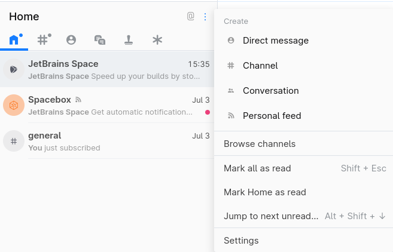

# Space automation with the API client

The purpose of this blog post is to explain some of the capabilities of the Space API client in the context of build automation.
One of the more interesting features of Space's Kotlin-based automation script is the ability to integrate with the other modules in the Space ecosystem.

For example, in response to a certain kind of build failure, the automation script could create a new issue or add a comment to an existing issue, by integrating with the Space planning module.
Alternatively, if there is a build failure, the automation script could log messages to a chat channel, by integrating with the Space chat module.
All of these integration capabilities can be accessed through the Space API client.

This post is organized as a tutorial, working on the assumption that you have never used JetBrains Space before.
There is therefore some groundwork to get through, setting up a Hello World project and initializing your first Space project, before we can start discussing the topic of Space automation with the API client.

Before you begin, make sure you have the following prerequisites:
- A GitHub account.
- A [JetBrains Space](https://www.jetbrains.com/space/) hosted account (free tier).

## Create a Hello World application

Before you can start exploring the capabilities of Space automation, you need to have some code to build.
A quick way to get started is to use the `gradle init` command to generate a complete Hello World application in Java.

Perform the following steps to create the Hello World application on your local machine:

1. If you do not already have `gradle` installed, follow the relevant [Gradle installation instructions](https://gradle.org/install/) for your OS.
2. In a command prompt, create a directory for the new Gradle project:
    ```
    mkdir jetbrains-demo
    ```

3. Switch to the new directory and run `gradle install`, as follows:
    ```
    cd jetbrains-demo
    gradle install
    ```

    When prompted, select the following options:
    - type of project: application
    - implementation language: Java
    - build script DSL: Kotlin
    - test framework: JUnit 4

4. Go to your GitHub home page, https://github.com/GH_ACCOUNT_NAME, and create a new Git repository for the project, `jetbrains-demo`.

5. In the `jetbrains-demo` directory on your local machine, enter the following Git commands to initialize the Git repository and push it upstream to GitHub (remembering to substitute your account name for `GH_ACCOUNT_NAME`):
    ```
    git init
    git add .
    git commit -m "Initial commit"
    git remote add origin git@github.com:GH_ACCOUNT_NAME/jetbrains-demo.git
    git push -u origin master
    ```

The Gradle Hello World application should now be available in the `jetbrains-demo` repo on GitHub.
To test the build locally, you can run the following command:

```
./gradlew build
```


## Prepare a Space project

In this step, you create a new Space project for building and working with the Hello World application.
If you do not already have a Space account, go to https://www.jetbrains.com/space/app/login and fill in the **Hosted by JetBrains** form to sign up for a free tier account.

After signing up for a Space account, you can create a new project and link it to the `jetbrains-demo` Git repository as follows:

1. Create a new Space project, by clicking the `+` icon from the row of icons in the upper-right corner of the screen.

   .

2. In the **New Project** dialog, enter JetBrains Space demo in the **Name** field, enter `JETBRAINS-DEMO` in the **Key** field, select the **Visibility** to be Internal, and then click **Create**.
3. The focus automatically switches to the new JetBrains Space demo project.
4. To import your `jetbrains-demo` GitHub repository into the Space project, click the **Repositories** tab on the sidebar and then click the **New repository** button.
5. In the **New Repository in JetBrains Space demo** dialog, click the **Import a repository** tab.
6. Copy the HTTPS URL for the `jetbrains-demo` GitHub repo (available under the GitHub **Code** button) and paste it into the **Remote repository URL** field in the dialog.
7. Click the slider switch to enable **Mirror changes from external repository**.
8. Under **Authentication**, select **Anonymous**.
9. Click **Create** to import the GitHub repository into the Space project.

## Prepare the Chat module

In this automation integration, the goal is to write an automation script that can publish messages to the `#developers` chat channel.
It is therefore necessary to create the `#developers` chat channel in the Chat module, as follows:

1. Click on the chat icon in the lower left of the screen.
2. Click on the vertical three dots icon and select **Create | Channel**.

    

3. In the **New Channel** dialog, create a new channel called `developers`.
4. Click **Create channel**.


## Add an automation script to your project

### Automation script

The automation script is written in a Kotlin-based DSL and stored in the `.space.kts` file in the root directory of the project.
For this Hello World example, we use the following automation script:

```kotlin
job("Build and publish") {
    container(displayName = "Build and notify", image = "gradle:7.2.0-jdk11") {
        kotlinScript { api ->
            val channel = ChannelIdentifier.Channel(ChatChannel.FromName("developers"))
            try {
                api.gradlew("build")
                val content = ChatMessage.Text("Build succeeded")
                api.space().chats.messages.sendMessage(channel = channel, content = content)
            } catch (ex: Exception) {
                val content = ChatMessage.Text("Build failed")
                api.space().chats.messages.sendMessage(channel = channel, content = content)

                // get current build run number
                val runNumber = api.executionNumber()
                val content2 = ChatMessage.Text("Job 'Build and publish' #$runNumber failed")
                api.space().chats.messages.sendMessage(channel = channel, content = content2)
            }
        }
    }
}
```

This script defines a build job that runs in a Docker container, using the `gradle:7.2.0-jdk11` Docker image.
The script has two main purposes:

- Build the Hello World application. The build is initiated by invoking `api.gradlew("build")`, which calls the `gradlew` wrapper script in the root directory of the project.
- Send status messages to the `#developer` chat channel, by invoking the `api.space()` API client.

### Space API client

The Space API client is a powerful tool for integrating automation scripts with the various Space modules.
By invoking `api.space()`, you get access to a wide range of Space modules, for example:
```kotlin
api.space().chats
api.space().projects.planning.issues
api.space().projects.planning.boards
api.space().projects.documents
api.space().projects.repositories
```

To further explore the integration capabilities offered by the Space API client, take a look at the [API Playground](https://www.jetbrains.com/help/space/api.html#api-playground), which can be accessed from your hosted account.

:::note
Not all module integrations are available on the free tier.
To see which modules the Automation Service is allowed to invoke, go to the **Administration** view (accessible through the three dots icon at the bottom of the sidebar), select **Roles** from the sidebar, and then select **Project Templates | Automation Service**, and click **View permissions**.
:::

In the current example, our automation script invokes the Space API client to integrate with the Chats module:
```kotlin
api.space().chats.messages.sendMessage(channel = channel, content = content)
```
This invocation sends the message stored in the `content` value to the `developers` chat channel.
Note that the arguments of `sendMessage` need to be initialized with the correct data types:
- `channel` is of `ChannelIdentifier.Channel` type
- `content` is of `ChatMessage.Text` type

To get a better understanding of the syntax for invoking the API client in Kotlin, see the [Space SDK](https://www.jetbrains.com/help/space/space-sdk.html) guide from the Space product documentation.

### Adding the automation script

To add the automation script to the Space project:

1. On your local machine, save the automation script to the `.space.kts` file in the root directory of the project.
2. Add the `.space.kts` file to source control and push to GitHub:
    ```shell
    git add .space.kts
    git commit -m "Added automation"
    git push
    ```
3. Resync the mirrored repository in your Space project to the `jetbrains-demo` repository in GitHub, as follows:

    1. In the JetBrains Space demo project, select the **Repositories | jetbrains-demo** tab from the sidebar to access the mirrored repository.
    2. In the top-right of the screen, click **Settings**.
    3. On the **Repository Settings** page, select the **Mirroring** tab and click **Sync now**.

4. After syncing the `.space.kts` script, a job automatically kicks off in Space. Go to the **Jobs** tab to see the job running.
5. To check whether the automation script succeeded in sending a message to the `#developers` channel, click the **Chats** icon from the row of icons at the bottom of the sidebar.
   In the chats view, select the `developers` channel to view the recent messages. If the build was successful, you should see the message:
    ```shell
    Automation Service
    Build succeeded
    ```


## Conclusion

Incorporating the Space API client into your automation scripts enables support for a variety of integration scenarios, limited only by your imagination (and also, perhaps, by the limitations of the free tier).
For further exploration of the API client's capabilities, it's recommended to take a look at the Space [API Playground](https://www.jetbrains.com/help/space/api.html#api-playground).

